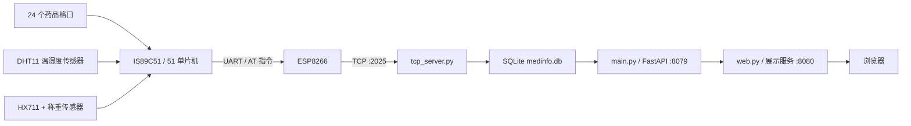

# 基于 51 单片机与 ESP8266 的药品仓储监测系统

本项目是一套面向药品仓储场景的环境与存量监测原型。下位机使用 51 单片机轮询 24 个药品格口，通过 DHT11 采集温湿度、HX711 采集重量，并借助 ESP8266 将数据发送到服务器。服务器接收数据后写入 SQLite，再由 FastAPI 接口和网页展示药品状态；温度、湿度或重量超过设定范围时，页面会将对应数据标红。

## 系统架构



## 主要功能

- 最多轮询 3 行 × 8 列，共 24 个药品格口。
- 每分钟读取一次当前格口的温度、湿度和重量。
- 通过 ESP8266 建立 TCP 连接并上报数据。
- 使用 SQLite 保存每个药品的最新状态。
- 提供药品列表及单个药品查询接口。
- 网页最多展示 24 条数据，并对异常值进行红色高亮。

当前网页阈值定义在 `TCP/static/index.html`：

| 指标  | 正常范围 |
| --- | --- |
| 温度  | 2～20 ℃ |
| 湿度  | 30%～70% |
| 重量  | 不低于 50 g |

## 硬件与引脚

| 模块  | 单片机引脚 | 说明  |
| --- | --- | --- |
| ESP8266 | P3.0 / P3.1 | 使用 8051 硬件串口 RXD / TXD，波特率 9600 |
| HX711 DOUT | P3.2 | 称重数据输入 |
| DHT11 DATA | P3.3 | 温湿度单总线数据 |
| HX711 SCK | P3.4 | 称重时钟输出 |
| 格口选择 | P0、P1、P2 | 每个端口对应一行，每行 8 个格口 |

固件中的延时和串口参数按 **11.0592 MHz** 晶振编写。实际硬件晶振必须与代码一致，否则 DHT11 时序、串口波特率和定时周期都可能不正确。P0 口作为普通 GPIO 使用时通常还需要外接上拉电阻，具体以硬件原理图为准。

## 软件环境

### 下位机

- Keil µVision 5
- Keil C51 工具链
- 当前工程目标器件：IS89C51
- 工程文件：`药品管理系统.uvproj`

工程时钟已统一为 11.0592 MHz，并已启用 HEX 文件生成。修复后的全部 C 源文件已使用 C51 9.57 和 BL51 6.22 完成命令行编译、链接及 HEX 转换，结果为 `0 Error(s), 0 Warning(s)`，程序占用约 2696 字节代码空间；最新固件位于 `Objects/main.hex`。

当前验证环境中的 C51/BL51 是评估版。现有程序可以成功生成固件，但继续增加固件功能时可能需要正式许可证或进一步压缩代码。

### 服务端

- Linux 或 Windows
- Python 3.10 及以上版本，原部署环境使用 Python 3.12
- FastAPI
- Uvicorn
- Tortoise ORM
- aiosqlite
- httpx

依赖已记录在 `TCP/requirements.txt`，首次部署时执行：

```bash
python -m pip install -r requirements.txt
```

## 目录结构

```text
.
├── main.c                    # 单片机主程序、定时轮询与报文组装
├── delay.c / delay.h         # 毫秒延时
├── DHT11.c / DHT11.h         # 温湿度采集
├── hx711.c / hx711.h         # 重量采集
├── usart.c / usart.h         # 8051 串口驱动
├── esp8266.c / esp8266.h     # ESP8266 AT 指令与 TCP 发送
├── STARTUP.A51               # 8051 启动文件
├── 药品管理系统.uvproj       # Keil 工程
├── Listings/                 # Keil 编译清单
├── Objects/                  # Keil 编译产物与构建日志
└── TCP/
    ├── tcp_server.py         # TCP 接收服务，监听 2025 端口
    ├── main.py               # 数据查询 API
    ├── models.py             # Tortoise ORM 数据模型
    ├── web.py                # 网页服务及 API 反向代理
    ├── static/index.html     # 数据展示页面
    ├── medinfo.db            # SQLite 数据库
    ├── requirements.txt      # Python 依赖列表
    ├── start.sh              # Linux 三服务启动脚本
    └── stop.sh               # 按 PID 安全停止服务
```

`Listings/`、`Objects/`、日志、SQLite 的 `-wal`/`-shm` 文件以及虚拟环境均属于运行或构建产物，后续使用 Git 管理时建议加入 `.gitignore`。

## 部署与运行

系统采用 TCP 接收、数据 API 和网页三个进程。修复后的 `start.sh` 会分别启动这三个服务，并用 PID 文件管理进程；也可以按后面的命令手动启动。

### 1. 创建 Python 环境

进入服务端目录：

```bash
cd TCP
```

Linux：

```bash
python3 -m venv .venv
source .venv/bin/activate
python -m pip install -r requirements.txt
```

Windows PowerShell：

```powershell
py -3 -m venv .venv
.\.venv\Scripts\Activate.ps1
python -m pip install -r requirements.txt
```

项目内现有 `.venv` 只保留了部分 Linux `site-packages` 内容，没有完整的解释器和激活脚本，不能直接复用，建议在部署机器上重新创建。

### 2. Linux 一键启动

```bash
bash start.sh
```

默认端口如下：

| 服务  | 监听地址 | 日志  |
| --- | --- | --- |
| TCP 接收 | `0.0.0.0:2025` | `tcp.log` |
| 数据 API | `127.0.0.1:8079` | `api.log` |
| 网页  | `0.0.0.0:8080` | `web.log` |

停止全部服务：

```bash
bash stop.sh
```

如需修改端口，可在启动命令前设置 `TCP_PORT`、`API_PORT` 或 `WEB_PORT` 环境变量。

### 3. 手动启动 TCP 接收服务

```bash
python tcp_server.py
```

该进程监听 `0.0.0.0:2025`，并在首次运行时创建 `med_info` 表。

### 4. 手动启动数据 API

另开一个终端，在 `TCP` 目录运行：

```bash
python -m uvicorn main:app --host 127.0.0.1 --port 8079
```

启动后可访问：

- API 文档：`http://127.0.0.1:8079/docs`
- 药品列表：`http://127.0.0.1:8079/meds`

### 5. 手动启动网页服务

再开一个终端，在 `TCP` 目录运行：

```bash
python -m uvicorn web:app --host 0.0.0.0 --port 8080
```

浏览器访问 `http://服务器地址:8080/`。如果需要从公网访问，请在防火墙或云服务器安全组中按需放行 TCP 端口 `2025` 和网页端口 `8080`；数据库 API 的 `8079` 端口只需本机访问时不应对公网开放。

### 6. 配置并编译下位机

编辑 `main.c` 中的网络配置：

```c
#define WIFI_SSID       "WiFi_name"
#define WIFI_PASSWORD   "WiFi_password"
#define SERVER_IP       "服务器 IP"
#define SERVER_PORT     "2025"
```

然后使用 Keil 打开 `药品管理系统.uvproj`：

1. 确认目标器件、晶振和实际硬件一致。
2. 确认 **Create HEX File** 保持勾选；工程文件已默认启用。
3. Build 工程并将生成的 HEX 文件烧录到单片机。
4. 确认 ESP8266 能访问服务器的 2025/TCP 端口。

不要将真实 Wi-Fi 密码提交到公开仓库。正式项目建议通过独立配置头文件或烧录配置保存网络凭据。

## 通信协议

下位机发送一行 ASCII 文本：

```text
MedNN/HUMIDITY/TEMP/WEIGHT\r\n
```

字段说明：

| 字段  | 含义  | 示例  |
| --- | --- | --- |
| `MedNN` | 格口编号，`NN = 行号 × 10 + 列号` | `Med01` |
| `HUMIDITY` | 可变长度的非负湿度整数 | `55` |
| `TEMP` | 可变长度的非负温度整数 | `18` |
| `WEIGHT` | 可变长度的非负重量整数 | `120` |

完整示例：

```text
Med01/55/18/120\r\n
```

服务器以换行符拆分报文，并兼容行尾残留的 `\r` 或 `\0`。`NAME_MAP` 当前只把 `Med01`、`Med02`、`Med03` 映射为中文药品名，其余编号直接保存。数据库以药品名为主键，通过 `update_or_create` 更新数据，因此当前只保留每个药品的**最新状态**，不保存历史曲线。

## API

数据 API 由 `main.py` 提供：

| 方法  | 路径  | 说明  |
| --- | --- | --- |
| GET | `/meds` | 返回全部药品记录数组，供网页代理使用 |
| GET | `/api/med` | 返回带 `code` 字段的全部药品记录 |
| GET | `/api/med/{name}` | 按药品名查询一条记录 |

示例：

```bash
curl http://127.0.0.1:8079/meds
```

## 已处理的联调问题

- TCP 服务已统一按 `\n` 拆包，与单片机实际发送的 `\r\n` 报文一致。
- `start.sh` 现会启动 TCP、API、Web 三个进程，API 与网页分别使用 8079 和 8080 端口；`stop.sh` 只停止 PID 文件记录且命令匹配的进程。
- 启动脚本、Python 文件和网页已统一为 UTF-8，网页标签及中文内容已修复。
- UART 和定时器 0 的 `TMOD` 配置会互相保留，1 ms 重装值按 11.0592 MHz 晶振计算。
- ESP8266 指令等待已增加超时和三次重试；发送失败时主程序会重新建立 Wi-Fi/TCP 连接后重发一次。
- 湿度、温度和重量改为可变长度数值，重量使用 `unsigned long`，不再受两位十进制限制。
- Keil 工程时钟已改为 11.0592 MHz，并启用 HEX 输出。
- DHT11 读取增加了阶段超时和校验，返回整数温湿度字节，失败时不会上报无效数据。

以上修改已通过 UTF-8、XML、Python 3.12 语法编译、前端 JavaScript、C51 编译、BL51 链接及 HEX 转换检查。当前 Windows 环境没有 Bash 和服务端第三方依赖，因此启动脚本及三个服务仍需在部署机创建虚拟环境后进行一次端到端运行验证；传感器时序和 ESP8266 通信也需要连接实际硬件确认。
